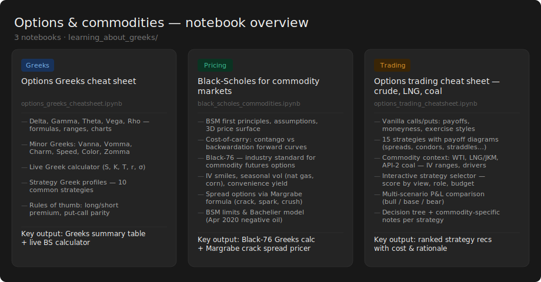

# learning_about_greeks

Reference notebooks for options Greeks, pricing models, and trading strategies — with a focus on commodity markets (crude oil, LNG, coal).

## Notebooks

### [options_greeks_cheatsheet.ipynb](options_greeks_cheatsheet.ipynb)
Quick-reference guide to the five primary Greeks (Delta, Gamma, Theta, Vega, Rho) and seven minor/higher-order Greeks (Vanna, Vomma, Charm, Speed, Color, Zomma, DvegaDtime). Includes formula derivations, charts, rules of thumb, a live Black-Scholes calculator, and a strategy Greek profiles table.

### [black_scholes_commodities.ipynb](black_scholes_commodities.ipynb)
Black-Scholes from first principles through to commodity-specific extensions:
- BSM assumptions and price surface
- Cost-of-carry model, contango vs. backwardation forward curves
- **Black-76** — the industry standard model for commodity futures options
- Implied volatility surfaces, vol smiles, and seasonal vol (natural gas, corn)
- Convenience yield deep dive
- Spread options via the **Margrabe formula** (crack spread, spark spread, crush spread)
- Where BSM breaks down (jumps, mean reversion, negative prices) and the Bachelier model fallback

### [options_trading_cheatsheet.ipynb](options_trading_cheatsheet.ipynb)
Practical trading reference covering crude oil, LNG (JKM), and coal (API-2 / Newcastle):
- Vanilla option types, moneyness, and exercise styles (European, American, Bermudan, Asian)
- 15 strategies with payoff diagrams: spreads, straddles, strangles, iron condors, collars, and more
- Commodity-specific context: typical IV ranges, key event drivers, hedging structures per market
- Interactive **strategy selector** — input your market view, role (producer/consumer/trader), and budget to get ranked recommendations with cost and rationale
- Multi-scenario P&L comparison across bull/base/bear price outcomes
- Decision tree and commodity-specific notes (OPEC plays, LNG Asian options, coal dark spreads)
