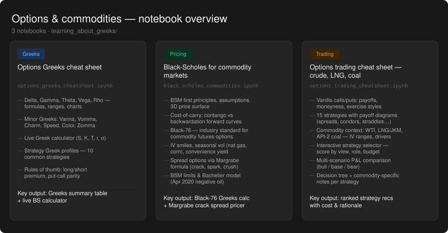

# learning_about_greeks

Reference notebooks for options Greeks, pricing models, and trading strategies — with a focus on commodity markets (crude oil, LNG, coal).



## Notebooks

### [options_greeks_cheatsheet.ipynb](options_greeks_cheatsheet.ipynb)
Quick-reference guide to the five primary Greeks (Delta, Gamma, Theta, Vega, Rho) and seven minor/higher-order Greeks (Vanna, Vomma, Charm, Speed, Color, Zomma, DvegaDtime). Includes formula derivations, charts, rules of thumb, a live Black-Scholes calculator, and a strategy Greek profiles table.

### [black_scholes_commodities.ipynb](black_scholes_commodities.ipynb)
Black-Scholes from first principles through to commodity-specific extensions:
- BSM assumptions and price surface
- Cost-of-carry model, contango vs. backwardation forward curves
- **Black-76** — the industry standard model for commodity futures options
- Implied volatility surfaces, vol smiles, and seasonal vol (natural gas, corn)
- Convenience yield deep dive
- Spread options via the **Margrabe formula** (crack spread, spark spread, crush spread)
- Where BSM breaks down (jumps, mean reversion, negative prices) and the Bachelier model fallback

### [options_trading_cheatsheet.ipynb](options_trading_cheatsheet.ipynb)
Practical trading reference covering crude oil, LNG (JKM), and coal (API-2 / Newcastle):
- Vanilla option types, moneyness, and exercise styles (European, American, Bermudan, Asian)
- 15 strategies with payoff diagrams: spreads, straddles, strangles, iron condors, collars, and more
- Commodity-specific context: typical IV ranges, key event drivers, hedging structures per market
- Interactive **strategy selector** — input your market view, role (producer/consumer/trader), and budget to get ranked recommendations with cost and rationale
- Multi-scenario P&L comparison across bull/base/bear price outcomes
- Decision tree and commodity-specific notes (OPEC plays, LNG Asian options, coal dark spreads)

### [option_strategy_advisor.ipynb](option_strategy_advisor.ipynb)
Interactive strategy advisor UI that removes the guesswork from choosing an option structure (crude and LNG). Answer four dropdown questions and get a concrete, priced recommendation:

1. **Commodity** — WTI Crude, Brent Crude, or LNG (JKM), each with default futures price, IV, contract size, and market-specific notes
2. **Your role** — Producer (long physical), Consumer (short physical), or Speculator
3. **Price view** — bearish / bullish / range-bound / big move either way
4. **Premium appetite** — pay premium, zero-cost, or collect premium

A decision matrix maps your answers to a primary strategy plus alternatives from a 14-strategy library (puts, calls, spreads, producer/consumer collars, straddles, strangles, iron condors, outright futures). Each recommendation comes with:

- A full trade card: every leg priced with **Black-76**, net premium per unit and per contract, breakevens, max profit/loss
- Net Greeks for the whole structure and a shaded payoff-at-expiry diagram
- Strategy-specific "when to use" and "watch out" warnings (e.g., short-strangle spike risk in LNG, asymmetric collar strikes in high-skew markets)

Use the live `ipywidgets` panel (Section 4) or the plain-code manual runner (Section 5). Section 6 has the full decision matrix and a Crude-vs-LNG practical differences table as static reference. Default market levels are illustrative — update `COMMODITIES` to live quotes before relying on the numbers.

## Strategy advisor as a web app

The advisor also ships as two standalone app front-ends. Both are thin UIs over the same engine module, so they always agree on the numbers:

| File | What it is |
|---|---|
| [advisor_core.py](advisor_core.py) | Shared engine (no UI): Black-76 pricing and Greeks, the 3 commodity profiles, the 14-strategy library, the 36-entry decision matrix, and `analyze_strategy()` / `recommend()` / `payoff_figure()` helpers. Import it from your own scripts too. |
| [streamlit_app.py](streamlit_app.py) | Streamlit web app built on `advisor_core` |
| [option_strategy_advisor_widgets.ipynb](option_strategy_advisor_widgets.ipynb) | ipywidgets panel built on `advisor_core` — runs in Jupyter, or serves as a web app via Voilà |

### Prerequisites

- **Python 3.10+** (tested on 3.13, miniconda)
- Packages: `numpy`, `scipy`, `matplotlib` (engine) + `streamlit` (app 1) + `ipywidgets`, `voila` (app 2) — all pinned loosely in [requirements.txt](requirements.txt):

```bash
pip install -r requirements.txt
```

Run everything from the repo root — both front-ends import `advisor_core.py` from the working directory.

### Option 1 — Streamlit app

```bash
streamlit run streamlit_app.py
# → opens http://localhost:8501
```

- Sidebar: commodity, role, price view, premium appetite, tenor — plus live market overrides (futures price, IV %, risk-free rate).
- Main panel: the recommended strategy and each alternative in their own tabs, each with a full trade card (legs priced with Black-76, net premium per unit and per contract, breakevens, max profit/loss), payoff-at-expiry chart, and net Greeks.
- The decision-matrix reference tables sit in an expander at the bottom.

### Option 2 — ipywidgets panel

**In Jupyter** (interactive notebook):

```bash
jupyter lab option_strategy_advisor_widgets.ipynb
# Run all cells, then drive the dropdown panel
```

**As a web app via Voilà** (code hidden, widgets live):

```bash
voila option_strategy_advisor_widgets.ipynb
# → opens http://localhost:8866
```

Same inputs as the Streamlit app; changing the commodity auto-resets futures price and IV to that market's profile, and an **Analyze** dropdown flips the trade card between the primary recommendation and its alternatives.

> Default prices and vols come from `advisor_core.COMMODITIES` and are illustrative — override them in the UI (or edit the dict) with live market levels before relying on the numbers.
